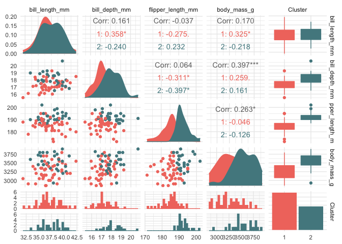

# VALIDICLUST

<!-- badges: start -->
[](https://github.com/benhvt/VALIDICLUST/actions)
<!-- badges: end -->

# Overview

`VALIDICLUST` s a package for ensuring valid inference after data
clustering. This problem occurs when clustering forces differences
between groups of observations to build clusters. This leads to an
inflation of the Type I error rate, especially because the data is used
twice: i) to build clusters, i.e., to form hypotheses, and ii) to
perform the inference step. The 3 main functions of the package are:

-   `test_selective_inference()` following the work of Gao et
    al. [\[1\]](#1) on selective inference for clustering

-   `merge_selective_inference()` for the merging selective test. In
    this method, all adjacent p-values are merged using the harmonic
    mean

-   `test_multimod()` uses the DipTest [\[2\]](#2) to investigate the
    presence of a continnum between two estimated clusters for a given
    variable

# Installation

Install the development version from GitHub

``` r
remotes::install_github("benhvt/VALIDICLUST")
```

# Example

To illustrate our proposed method, we use the
[palmerpenguins](https://allisonhorst.github.io/palmerpenguins/) dataset
from the `palmerpenguins` package. To ensure that there are no truly
separate groups of observations, we selected only the female penguins of
the Adelie species, yielding 73 observations. On this dataset, we apply
hierarchical clustering (on Euclidean distances with Ward linkage) to
build 2 clusters. In this negative control dataset, we know the true,
i.e., the non-existing separated group of observations. We therefore
apply our 3 tests to each of the 4 numerical measurements to test for
separation of the 2 clusters, and compare the resulting p-values to the
p-values of the classical t-test.

``` r
data("penguins")
data <- subset(penguins, species == "Adelie" & sex == "female")
data <- data[,3:6]

# Clustering function 
hcl2 <- function(x){
  x <- scale(x, center = T, scale = T)
  distance <- dist(x, method = "euclidean")
  cah <- hclust(distance, method = "ward.D2")
  return(as.factor(cutree(cah, k=2)))
}

data$Cluster <- hcl2(data)

ggpairs(data, aes(colour = Cluster, fill = Cluster)) + 
  scale_colour_manual(values = c("#F1786D","#53888f")) + 
  scale_fill_manual(values = c("#F1786D","#53888f")) + 
  theme_minimal()
```

<!-- -->

``` r
pval.inference.selective <- pval.merge <- pval.multimod <- pval.t.test <- rep(NA, 4)
for (i in 1:4){
  pval.inference.selective[i] <- test_selective_inference(as.matrix(data[,1:4]), 
                                                          k1=1, 
                                                          k2=2, 
                                                          g=i, 
                                                          cl_fun = hcl2, 
                                                          cl=data$Cluster)$pval
  pval.merge[i] <- merge_selective_inference(as.matrix(data[,1:4]),
                                             k1=1, 
                                             k2=2, 
                                             g=i, 
                                             cl_fun = hcl2,
                                             cl=data$Cluster)$pval
  pval.multimod[i] <- test_multimod(as.matrix(data[,1:4]),
                                    g=i,
                                    k1=1, 
                                    k2=2,
                                    cl = data$Cluster)$pval
  pval.t.test[i] <- t.test(data[data$Cluster == 1,i], data[data$Cluster==2, i])$p.value
}


pval.res <- rbind(pval.inference.selective, 
                  pval.merge,
                  pval.multimod,
                  pval.t.test)

colnames(pval.res) <- gsub("_", x=colnames(data)[1:4], replacement = " ")
rownames(pval.res) <- c("Selective Inference",
                        "Merging Selective Inference",
                        "Multimoality test", 
                        "T-test")

round(pval.res,3) %>% htmlTable::htmlTable()
```

<table class="gmisc_table" style="border-collapse: collapse; margin-top: 1em; margin-bottom: 1em;">
<thead>
<tr>
<th style="border-bottom: 1px solid grey; border-top: 2px solid grey;">
</th>
<th style="font-weight: 900; border-bottom: 1px solid grey; border-top: 2px solid grey; text-align: center;">
bill length mm
</th>
<th style="font-weight: 900; border-bottom: 1px solid grey; border-top: 2px solid grey; text-align: center;">
bill depth mm
</th>
<th style="font-weight: 900; border-bottom: 1px solid grey; border-top: 2px solid grey; text-align: center;">
flipper length mm
</th>
<th style="font-weight: 900; border-bottom: 1px solid grey; border-top: 2px solid grey; text-align: center;">
body mass g
</th>
</tr>
</thead>
<tbody>
<tr>
<td style="text-align: left;">
Selective Inference
</td>
<td style="text-align: center;">
0.135
</td>
<td style="text-align: center;">
0.759
</td>
<td style="text-align: center;">
0.509
</td>
<td style="text-align: center;">
0.431
</td>
</tr>
<tr>
<td style="text-align: left;">
Merging Selective Inference
</td>
<td style="text-align: center;">
0.146
</td>
<td style="text-align: center;">
0.721
</td>
<td style="text-align: center;">
0.489
</td>
<td style="text-align: center;">
0.467
</td>
</tr>
<tr>
<td style="text-align: left;">
Multimoality test
</td>
<td style="text-align: center;">
0.806
</td>
<td style="text-align: center;">
0.193
</td>
<td style="text-align: center;">
0.044
</td>
<td style="text-align: center;">
0.599
</td>
</tr>
<tr>
<td style="border-bottom: 2px solid grey; text-align: left;">
T-test
</td>
<td style="border-bottom: 2px solid grey; text-align: center;">
0.4
</td>
<td style="border-bottom: 2px solid grey; text-align: center;">
0
</td>
<td style="border-bottom: 2px solid grey; text-align: center;">
0
</td>
<td style="border-bottom: 2px solid grey; text-align: center;">
0
</td>
</tr>
</tbody>
</table>

# References

<a id="1">\[1\]</a> Gao, L. L., Bien, J., & Witten, D. (2020). Selective
inference for hierarchical clustering. arXiv preprint arXiv:2012.02936.

<a id="2">\[2\]</a> HARTIGAN, John A. et HARTIGAN, Pamela M. The dip
test of unimodality. The annals of Statistics, 1985, p. 70-84.
